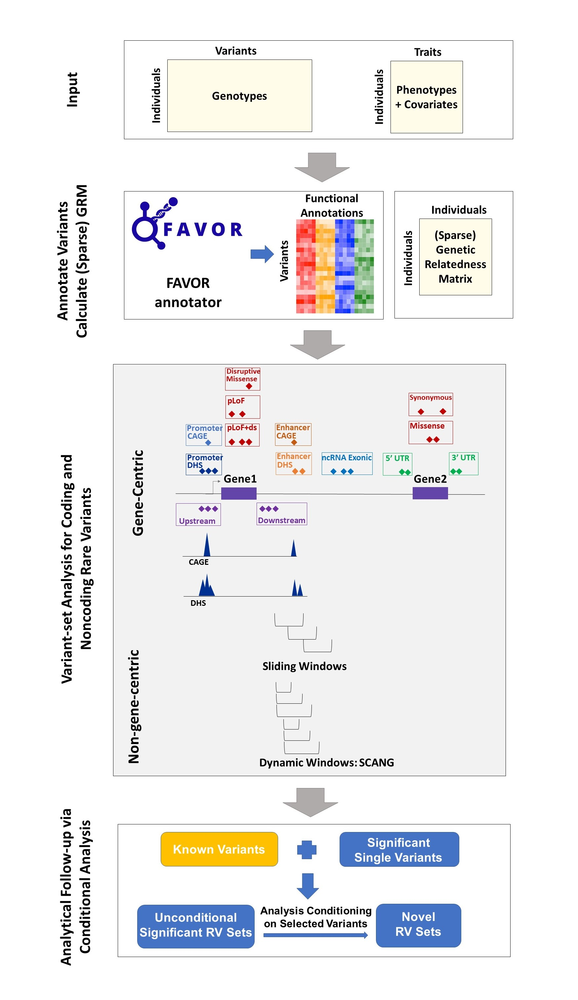

[](https://github.com/xihaoli/STAARpipeline/actions)
[](https://app.travis-ci.com/github/xihaoli/STAARpipeline)
[](https://ci.appveyor.com/project/xihaoli/staarpipeline/branch/main)
[](https://www.gnu.org/licenses/gpl-3.0)

# STAARpipeline
This is an R package for performing association analysis of whole-genome/whole-exome sequencing (WGS/WES) studies using STAAR pipeline.
## Description
STAARpipeline is an R package for phenotype-genotype association analyses of WGS/WES data, including single variant analysis and variant set analysis. The single variant analysis in STAARpipeline provides valid individual *P* values of variants given a MAF or MAC cut-off. The variant set analysis in STAARpipeline includes gene-centric analysis and non-gene-centric analysis of rare variants. The gene-centric coding analysis provides five genetic categories: putative loss of function (pLoF), missense, disruptive missense, pLoF and disruptive missense, and synonymous. The gene-centric noncoding analysis provides eight genetic categories: promoter or enhancer overlaid with CAGE or DHS sites, UTR, upstream, downstream, and noncoding RNA genes. The non-gene-centric analysis includes sliding window analysis with fixed sizes and dynamic window analysis with data-adaptive sizes. STAARpipeline also provides analytical follow-up of dissecting association signals independent of known variants via conditional analysis using <a href="https://github.com/xihaoli/STAARpipelineSummary">STAARpipelineSummary</a>.
## Workflow Overview

## Prerequisites
<a href="https://www.r-project.org">R</a> (recommended version >= 3.5.1)

For optimal computational performance, it is recommended to use an R version configured with the Intel Math Kernel Library (or other fast BLAS/LAPACK libraries). See the <a href="https://software.intel.com/en-us/articles/using-intel-mkl-with-r">instructions</a> on building R with Intel MKL.
## Dependencies
STAARpipeline links to R packages <a href="https://cran.r-project.org/web/packages/Rcpp/index.html">Rcpp</a> and <a href="https://cran.r-project.org/web/packages/RcppArmadillo/index.html">RcppArmadillo</a>, and also imports R packages <a href="https://cran.r-project.org/web/packages/Rcpp/index.html">Rcpp</a>, <a href="https://github.com/xihaoli/STAAR">STAAR</a>, <a href="https://github.com/zilinli1988/SCANG">SCANG</a>, <a href="https://cran.r-project.org/web/packages/dplyr/index.html">dplyr</a>, <a href="https://bioconductor.org/packages/release/bioc/html/SeqArray.html">SeqArray</a>, <a href="https://bioconductor.org/packages/release/bioc/html/SeqVarTools.html">SeqVarTools</a>, <a href="https://bioconductor.org/packages/release/bioc/html/GenomicFeatures.html">GenomicFeatures</a>, <a href="https://bioconductor.org/packages/release/data/annotation/html/TxDb.Hsapiens.UCSC.hg38.knownGene.html">TxDb.Hsapiens.UCSC.hg38.knownGene</a>, <a href="https://cran.r-project.org/web/packages/GMMAT/index.html">GMMAT</a>, <a href="https://bioconductor.org/packages/release/bioc/html/GENESIS.html">GENESIS</a>, <a href="https://cran.r-project.org/web/packages/Matrix/index.html">Matrix</a>. These dependencies should be installed before installing STAARpipeline.
## Installation
```
library(devtools)
devtools::install_github("xihaoli/STAARpipeline")
```
## Usage
Please see the <a href="docs/STAARpipeline_manual.pdf">**STAARpipeline** user manual</a> for detailed usage of STAARpipeline package. Please see the <a href="https://github.com/xihaoli/STAARpipeline-Tutorial">**STAARpipeline** tutorial</a> for a detailed example of analyzing sequencing data using STAARpipeline.
## Data Availability
The whole-genome individual functional annotation data assembled from a variety of sources and the computed annotation principal components are available at the [Functional Annotation of Variant - Online Resource (FAVOR)](http://favor.genohub.org) site.
## Version
The current version is 0.9.6 (November 5, 2021).
## License
This software is licensed under GPLv3.


[GNU General Public License, GPLv3](http://www.gnu.org/copyleft/gpl.html)
